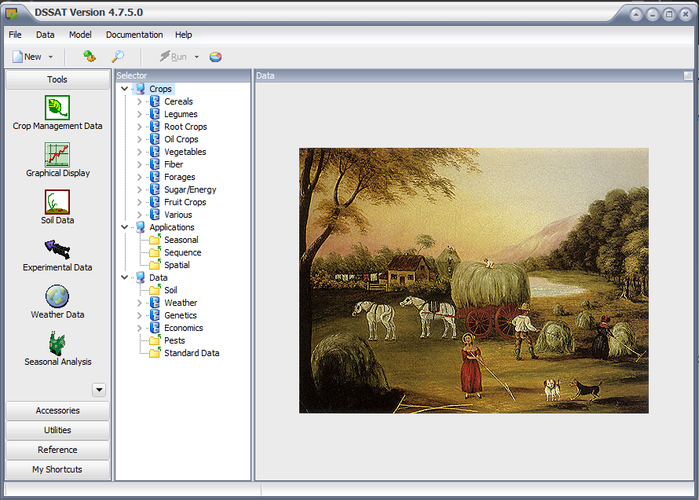
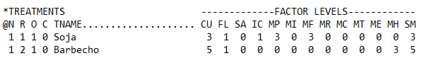
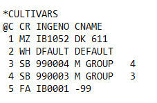
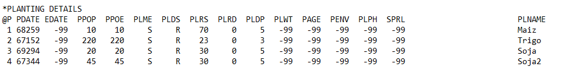

# Herramienta para automatización de DSSAT

- Lucas A. Figarola: lfigarola@dc.uba.ar 
- Felipe Ghersa: felipeghersa@agro.uba.ar
- Rodrigo Castro: rcastro@dc.uba.ar
- Diego O. Ferraro: ferraro@agro.uba.ar

*Universidad de Buenos Aires (UBA), Facultad de Ciencias Exactas y Naturales, Departamento de Computación. CONICET, Instituto de Ciencias de la Computación (ICC)*

*Universidad de Buenos Aires (UBA), Facultad de Agronomía, Cátedra de Cerealicultura. UBA-CONICET, Instituto de Investigaciones Fisiológicas y Ecológicas Vinculadas a la Agricultura (IFEVA)*

## Acerca de:
Automatización del modelo de simulación de cultivos DSSAT es una herramienta creada en python que automatiza la generación de archivos requeridos por DSSAT para correr modelos.
En su forma basica, el script puede ser usado inmediatamente ingresando un nombre de un archivo .SQX que se debe encontrar en la carpeta secuence dentro de DSSAT.
En script.py estan las principales funciones para correr el script. Hay dos opciones para correr: La funcion script_sequences que corre DSSAT para cada secuencia generada en el sequence_generator. La funcion run_generator_sequences que corre DSSAT para secuencias especificas que quieras probar. 

## Requerimientos de Instalación:

La herramienta de automatización fue desarrollada en **Python 3**.

- Paquetes requeridos:
  - Matplotlib
  - Numpy

Es necesario contar con una instalación de **DSSAT**, solo disponible para Microsoft Windows. Para descargar DSSAT es necesario ingresar a la página (https://apps.agapps.org/ide/serial/index.php/request?sft=3) y solicitar a los desarrolladores el envío del instalador por correo electrónico. Junto con el instalador se envian los manuales de instrucciones así como referencias de uso del software.

## Insumos

- Suelo
- Clima
- Genotipo
- SQX inicial
- Matriz de restricciones

## Requerimientos .SQX

  Se debe respetar los ids de cada cultivo.
  
  
  
  
  
  

## Instrucciones para correr la herramienta
 
 Ejecutar el archivo script.py

## Salida: Prueba de Concepto
